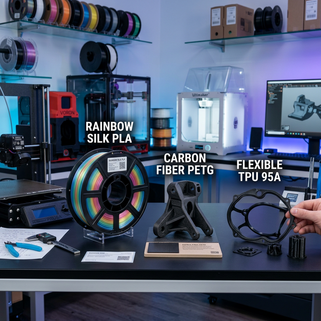

# 🚀 Printh 3D — Impressão 3D de Alta Performance



A **Printh 3D** é uma plataforma moderna e premium especializada em serviços de manufatura aditiva (impressão 3D) personalizada. Transformamos conceitos digitais em objetos físicos com precisão industrial, focando em uma experiência de usuário impecável e resultados de alta fidelidade.

---

## ✨ Características Principais

- **🎨 Design Premium**: Interface moderna com estética dark mode, glassmorphism e animações fluidas (Framer Motion).
- **📦 Catálogo de Produtos**: Galeria curada de modelos otimizados para diversas aplicações (Colecionáveis, Decoração, Industrial).
- **📚 Central de Conhecimento**: Seção educativa sobre materiais (PLA, ABS, PETG, TPU) e processos de fabricação.
- **🛍️ Integração Shopee**: Conexão direta com loja oficial na Shopee para compras com garantia da plataforma.
- **📱 Ultra Responsivo**: Otimização completa para dispositivos móveis, garantindo a melhor experiência em qualquer tela.

---

## 🛠️ Tecnologias Utilizadas

O projeto foi construído utilizando as tecnologias mais modernas do ecossistema Web:

- **Framework**: [Next.js 15](https://nextjs.org/) (App Router)
- **Estilização**: [Tailwind CSS](https://tailwindcss.com/)
- **Animações**: [Framer Motion](https://www.framer.com/motion/)
- **Ícones**: [Lucide React](https://lucide.dev/)
- **Linguagem**: [TypeScript](https://www.typescriptlang.org/)
- **Visualização 3D**: [React Three Fiber](https://docs.pmnd.rs/react-three-fiber/getting-started/introduction) (para o cubo do simulador)

---

## 🚀 Como Iniciar

### Pré-requisitos
- Node.js (v18+)
- npm ou yarn

### Instalação
1. Clone o repositório:
```bash
git clone https://github.com/vftheodoro/Printh3D_Site.git
```

2. Instale as dependências:
```bash
npm install
```

3. Inicie o servidor de desenvolvimento:
```bash
npm run dev
```

4. Acesse `http://localhost:3000` no seu navegador.

---

## 📂 Estrutura do Projeto

```text
src/
├── app/              # Rotas e Páginas (Next.js App Router)
│   ├── contato/      # Página de Contato e Redes Sociais
│   ├── materias/     # Guia técnico de materiais
│   ├── orcamento/    # Simulador interativo de orçamento
│   └── produtos/     # Catálogo de modelos
├── components/       # Componentes React reutilizáveis
│   ├── home/         # Hero, Features, FAQ
│   ├── layout/       # Navbar, Footer
│   └── products/     # Cards de produtos e filtros
├── lib/              # Lógica de negócios e dados (produtos, utilitários)
└── public/           # Assets estáticos (Images, Logos, Favicon)
```

---

## 🎨 Identidade Visual

- **Primária**: Azul Printh3D (`#3B82F6`)
- **Fundo**: Slate Deep Dark (`#020617`)
- **Tipografia**: Outfit (Google Fonts)

---

## 👨‍💻 Desenvolvido por

**Victor Theodoro**
- [Portfólio](https://vftheodoro.github.io/Portfolio/)
- [LinkedIn](https://www.linkedin.com/in/victor-theodoro-braz-teixeira-603125206/)

---

*Transformando bits em átomos com precisão e estilo.* 🛠️✨
